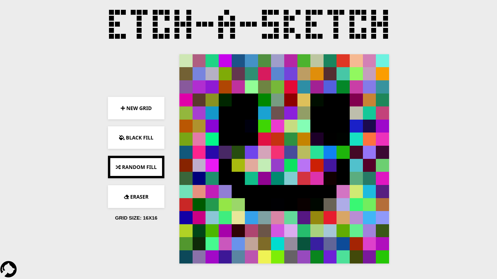
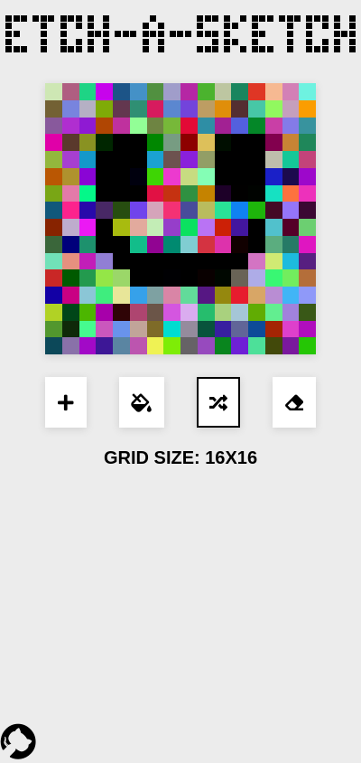
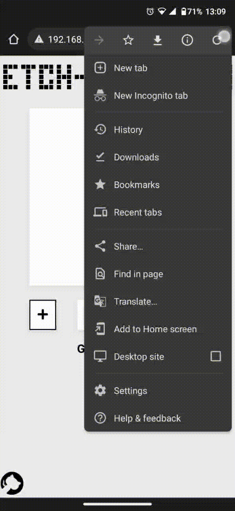

# Etch-A-Sketch - Odin project
[Etch-A-Sketch](https://en.wikipedia.org/wiki/Etch_A_Sketch) implemented in JavaScript with a simple graphical user interface. This project was an assignment from [Odin's Foundations path](https://www.theodinproject.com/paths/foundations/courses/foundations/lessons/etch-a-sketch-project).

## Screenshots

### Desktop

### Mobile

## Demo

